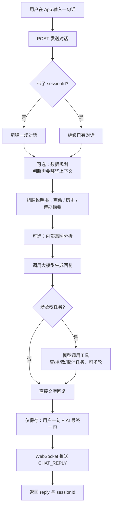
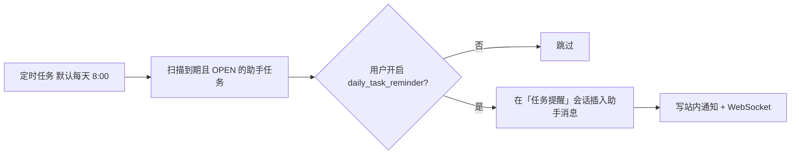

# AI 对话与助手任务 — 业务流程说明

本文档描述当前后端已实现的 **智能对话、助手待办、站内通知与任务提醒** 的业务流程，便于产品、测试与前端同学理解，**不依赖阅读 Java 代码**。  
接口字段与路径详见 **`md文档/HTTP接口-AI对话与通知.md`**；表结构见 **`md文档/数据库.md`** 第 13～16 节。

---

## 1. 功能边界（先分清三件事）

| 概念 | 是什么 | 用户在哪看到 |
|------|--------|--------------|
| **AI 对话会话** | 用户与智能助手的一路聊天记录（可多轮） | App 聊天页 |
| **助手任务** | 用户在对话里让 AI 记的**个人待办**（标题、说明、截止日期、完成/取消） | 任务列表 + 对话里由 AI 说明操作结果 |
| **成长计划任务**（`tasks` 表） | 目标拆解后排期的**每日学习任务** | 成长计划模块（与助手任务**不是同一张表**） |

助手任务由 AI 通过后端「工具」增删改查，**不会**自动写入成长计划的 `tasks` 表。

---

## 2. 用户主动发一条消息（主流程）



### 2.1 分步说明

1. **鉴权**：须已登录，请求头带 `Authorization: Bearer {accessToken}`。
2. **会话**：首次不传 `sessionId` 会新建会话；后续把上次返回的 `sessionId` 原样带回即可续聊。会话标题默认取首条用户消息前 200 字。
3. **数据规划**（配置 `app.chat.multi-phase-enabled=true` 时，默认开启）：在正式回答前，后端会**额外调用一次**大模型（用户不可见），判断本轮是否需要：
   - 历史聊天记录
   - 用户画像（昵称、爱好、每周小时数等）
   - 待办任务列表摘要
   - 是否开放任务管理工具  
   规划失败时使用「全加载」的保守策略。
4. **意图分析**（同上开关开启时）：再让大模型用几句话总结用户意图，**仅给正式回答参考**，不会原样展示给用户。
5. **正式回答**：将「系统说明书 +（可选）历史 + 用户本轮输入」发给配置的 AI 提供商（默认 **mimo**，可指定 **ollama**）。
6. **任务工具**：当用户要记待办、查任务、改状态等，大模型可多次调用后端工具（默认最多 5 轮），工具结果再喂回模型，最后输出面向用户的一段话。
7. **落库规则**：数据库里**只存两条**——本轮用户消息、本轮助手最终回复。中间的规划、意图分析、工具调用过程**不写入** `ai_chat_messages`。
8. **实时推送**：若客户端已连接 WebSocket，会收到 `type=CHAT_REPLY` 的 JSON（含会话 id、消息 id、正文预览等）。

### 2.2 相关配置（`application.yaml` / 环境变量）

| 配置 | 含义 | 默认 |
|------|------|------|
| `app.chat.default-provider` / `AI_CHAT_DEFAULT_PROVIDER` | 默认 AI 提供商 | `mimo` |
| `app.chat.multi-phase-enabled` / `AI_CHAT_MULTI_PHASE_ENABLED` | 是否启用规划 + 意图分析 | `true` |
| `app.chat.max-history-messages` | 正式回答带入的历史条数上限 | `24` |
| `app.chat.max-tool-rounds` | 任务工具最多轮次 | `5` |
| `app.chat.push-on-reply-enabled` | 对话回复是否 WebSocket 推送 | `true` |
| `MIMO_API_KEY` | MiMo API Key | 必填（使用 mimo 时） |

---

## 3. 查看历史消息

- 接口：`GET /api/v1/ai/chat/sessions/{sessionId}/messages`
- 仅能查看**当前登录用户自己**的会话。
- 返回按时间**升序**的消息列表；每条为 `USER` 或 `ASSISTANT` 角色（与落库规则一致，不含内部工具消息）。

---

## 4. 助手任务（AI 可执行的操作）

大模型通过后端工具操作 `user_assistant_tasks` 表，对用户可见能力如下：

| 用户说法示例 | 后端行为 |
|--------------|----------|
| 「帮我记周五交报告」 | 创建任务，`status=OPEN`，可选 `dueDate` |
| 「我有哪些没做的？」 | 列出任务，可按 `OPEN` / `DONE` / `CANCELLED` 筛选 |
| 「把 3 号任务标成完成」 | 更新 `status=DONE` |
| 「那个任务不要了」 | 取消任务（`status=CANCELLED`） |

用户也可不经过 AI，直接调用 **`GET /api/v1/users/me/tasks`** 查看任务清单（可选 `status` 查询参数）。

---

## 5. 定时任务提醒（用户未主动说话）



- **触发**：`AssistantTaskReminderScheduler`，cron 默认 `0 0 8 * * ?`（上海时区可配）。
- **条件**：任务 `due_date` 不晚于用户当地「今天」、状态为 `OPEN`、当日尚未发过提醒、用户 `daily_task_reminder` 开关为开。
- **内容**：由后端按模板生成（逾期 / 今日待办），**不是**现场调用大模型生成。
- **会话**：每个用户固定一个标题为 **「任务提醒」** 的会话；提醒消息以 `ASSISTANT` 角色写入，便于用户在聊天里继续回复「完成了」等，再由 AI 调工具更新任务。
- **通知**：写入 `user_in_app_notifications`，类型 `TASK_DUE_REMINDER`；若开启推送则 WebSocket 下发（见下节）。

相关配置：`app.task-reminder.enabled`、`in-app-enabled`、`push-enabled`、`cron`、`zone`。

---

## 6. WebSocket 实时推送

| 项目 | 说明 |
|------|------|
| 地址 | `ws://{host}/ws/v1/chat`（生产用 `wss://`） |
| 鉴权 | 握手时 Query `token={accessToken}`，或 Header `Authorization: Bearer {accessToken}` |
| 方向 | **仅服务端 → 客户端**；客户端上行可忽略（可发 ping） |

### 6.1 推送 JSON 类型

**对话回复**（`app.chat.push-on-reply-enabled=true`）：

```json
{
  "type": "CHAT_REPLY",
  "sessionId": 1,
  "messageId": 42,
  "contentPreview": "好的，已为你创建…",
  "unreadCount": 0
}
```

**任务到期提醒**（`app.task-reminder.push-enabled=true`）：

```json
{
  "type": "TASK_DUE_REMINDER",
  "notificationId": 10,
  "sessionId": 2,
  "messageId": 55,
  "taskId": 7,
  "title": "今日待办：完成周报",
  "body": "今天（2026-05-16）有一项待办…",
  "unreadCount": 1
}
```

`unreadCount` 为当前用户**站内通知**未读条数（不含聊天已读状态）。

---

## 7. 站内通知

- 列表 / 未读数 / 标记已读：见 **`md文档/HTTP接口-AI对话与通知.md`** 第 4 章。
- 与对话的关系：通知可携带 `sessionId`、`messageId`，便于点击跳转到对应会话与消息。

---

## 8. 数据库脚本（已有库升级）

按顺序在 MySQL 执行（仓库 `scripts/` 目录）：

1. `mysql-ai-chat.sql` — 会话、消息、助手任务表  
2. `mysql-ai-chat-task-reminder.sql` — 任务表增加 `reminder_sent_at`（若已含于建表脚本可跳过）  
3. `mysql-in-app-notifications.sql` — 站内通知表  

应用使用 `ddl-auto: validate` 时，须先执行脚本再启动。

---

## 9. 主要代码入口（供开发查阅）

| 职责 | 类 |
|------|-----|
| 对话编排 | `AiChatService` |
| 数据规划 / 意图分析 | `AiChatPlanningService` |
| 用户上下文组装 | `AiChatUserContextBuilder` |
| 任务工具执行 | `AiChatToolExecutor` |
| 大模型 HTTP 客户端 | `OpenAiCompatibleChatClient` |
| 到期提醒 | `AssistantTaskReminderService`、`AssistantTaskReminderScheduler` |
| 提醒专用会话 | `AiChatReminderSessionService` |
| 站内通知 + 推送 | `InAppNotificationService`、`ChatRealtimePushService` |

---

## 10. 文档维护

业务流程或配置变更时，请同步更新：

- 本文件（`md文档/AI对话与助手任务-流程说明.md`）
- `md文档/HTTP接口-AI对话与通知.md`
- `md文档/数据库.md`（表结构章节）
- `docs/openapi/v1-ai-chat.yaml`（若存在 OpenAPI 约定）
